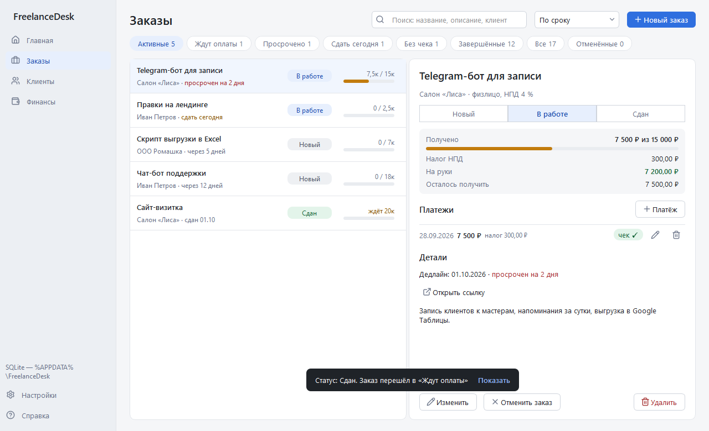
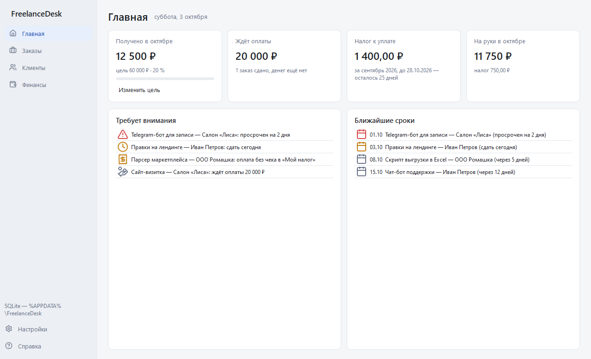
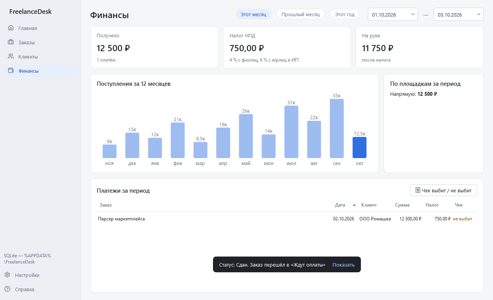
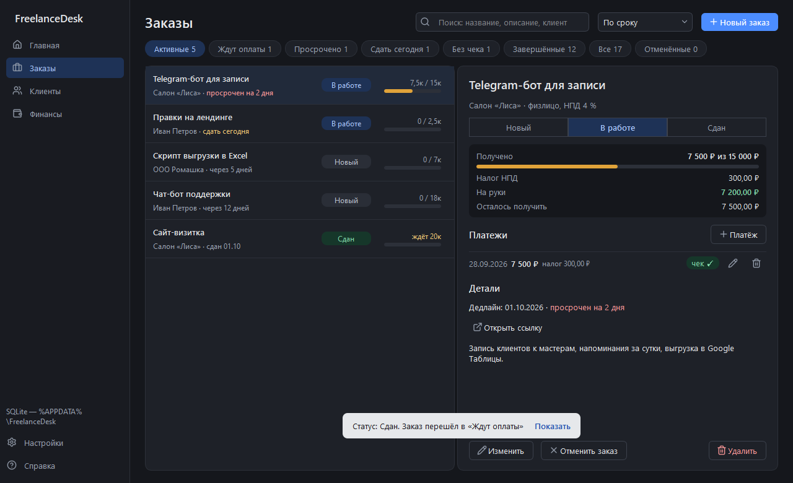

# FreelanceDesk

Десктоп-приложение для самозанятого фрилансера: заказы, сроки, платежи, доход и налог НПД. Работает сразу после запуска, сервер базы данных не нужен.



Есть светлая и тёмная темы (или «как в Windows»), плавные анимации и уведомления о действиях.

## Как устроен учёт

Работа и деньги у заказа разделены.

- **Статус работы** вы меняете сами: новый → в работе → сдан (или отменён).
- **Платёж** — это деньги, которые пришли: сумма, дата и отметка «чек выбит в «Мой налог»». Предоплата и остаток — два платежа.
- По платежам программа сама считает, сколько получено и сколько осталось, налог НПД (4 % с физлиц, 6 % с юрлиц и ИП) и сумму на руки.

В платёж вписывается сумма, которая реально пришла: на Kwork — уже без комиссии площадки. Налог платится именно с неё.

## Экраны

**Главная** — получено за месяц и прогресс к цели, сколько денег ждёте за сданную работу, налог за прошлый месяц со сроком уплаты (до 28-го числа), список «Требует внимания» (просрочено, сдать сегодня, нет чека, ждёт оплаты) и ближайшие сроки. Щелчок по строке открывает заказ.



**Заказы** — фильтры с числом заказов (активные, ждут оплаты, просрочено, сдать сегодня, без чека, завершённые), поиск по названию, описанию и клиенту, сортировка. Справа карточка заказа: статус в один щелчок, получено и осталось, налог, платежи с отметкой о чеке, описание и ссылка.

**Клиенты** — тип клиента (от него зависит ставка налога), контакт, площадка, число заказов и полученные деньги.

**Финансы** — поступления, налог и сумма на руки за любой период, разбивка по площадкам, диаграмма за 12 месяцев и журнал платежей для сверки с «Мой налог».



**Настройки** внизу бокового меню: тема (светлая, тёмная, как в системе), анимации, папка с данными.



## Горячие клавиши

| Клавиши | Действие |
|---|---|
| Ctrl+1…4 | Главная, Заказы, Клиенты, Финансы |
| Ctrl+N / Ctrl+Shift+N | новый заказ / новый клиент |
| Ctrl+P | платёж по выбранному заказу |
| F2 / Delete | изменить / удалить выбранное |
| Ctrl+F | поиск |
| Ctrl+T | светлая / тёмная тема |
| F5 | обновить |

## Установка и запуск

Нужен Python 3.11 или новее.

```powershell
git clone https://github.com/ZniKDK/FreelanceDesk.git
cd FreelanceDesk
python -m venv .venv
.venv\Scripts\Activate.ps1
pip install -r requirements.txt
python main.py
```

При первом запуске программа создаёт папку `%APPDATA%\FreelanceDesk`:

| Файл | Что в нём |
|---|---|
| `config.ini` | где хранить данные |
| `freelancedesk.db` | база SQLite с заказами, клиентами и платежами |
| `ui_state.ini` | размер окна, экран, фильтр, цель на месяц, тема, анимации |

Папка открывается через «Настройки → Открыть папку с данными» внизу бокового меню. Чтобы хранить данные в другом месте (например, на флешке), задайте переменную окружения `FREELANCEDESK_HOME`.

Схема базы обновляется сама при запуске новой версии; данные старых версий переносятся автоматически.

### PostgreSQL (необязательно)

SQLite хватает для одного пользователя. Если нужен сервер PostgreSQL (14+):

1. Создайте пользователя и базу:
   ```sql
   CREATE ROLE freelancedesk LOGIN PASSWORD 'ваш_пароль';
   CREATE DATABASE freelancedesk OWNER freelancedesk;
   ```
2. В `%APPDATA%\FreelanceDesk\config.ini` укажите `backend = postgresql` и заполните секцию `[database]` (образец — `config/config.example.ini`).

## Тесты

```powershell
pytest
```

Тесты хранилища запускаются на SQLite и на PostgreSQL. Для PostgreSQL нужна база `freelancedesk_test` и файл `config/config.ini` с параметрами подключения; без них эти варианты пропускаются. Тесты интерфейса работают без показа окон.

## Стек

Python 3.11+, PyQt6, SQLite / PostgreSQL (psycopg 3), pytest. Иконки — [Lucide](https://lucide.dev) (ISC).

## Структура

```
src/freelancedesk/
├── core/          # логика без Qt: модели, хранилища, OrderManager
└── app/           # интерфейс на PyQt6
    └── pages/     # экраны: главная, заказы, клиенты, финансы
tests/             # unit-, интеграционные и UI-тесты
migrations/        # SQL-миграции: sqlite/ и postgresql/
resources/icons/   # иконки Lucide
config/            # образец настроек
docs/              # архитектура, скриншоты
```

Подробнее — в [docs/architecture.md](docs/architecture.md).

## Лицензия

MIT
